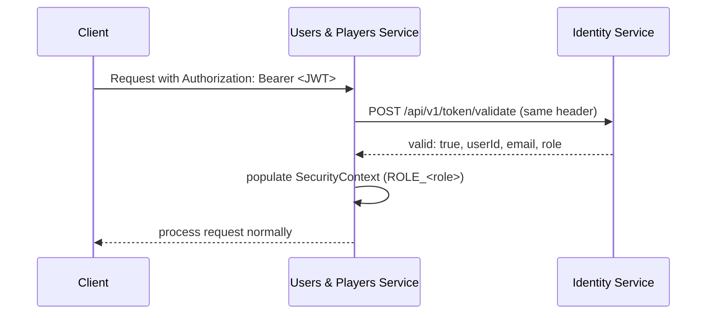

# Architecture

Users & Players Service follows **hexagonal architecture** (ports and
adapters): a framework-free domain core (`core/domain`), use cases in
`application/service`, and adapters in `infrastructure`.

## Layers

```
core/domain/            -> Usuario, OTP, enums (AccountStatus, UserRole, UserType, PosicionJuego, TipoIdentificacion)
core/exception/          -> Domain exceptions
core/ports/in/            -> Use cases (interfaces)
core/ports/out/           -> Outbound ports (interfaces)
core/util/                -> UuidParser

application/service/     -> Use case implementations (ports/in)

infrastructure/adapter/in/rest/         -> REST controllers, DTOs
infrastructure/adapter/out/repository/   -> MongoDB adapters
infrastructure/adapter/out/identity/     -> Feign client to Identity Service
infrastructure/adapter/out/teams/        -> Feign client to Teams Service
infrastructure/adapter/out/tournament/   -> Adapter for active-tournament checks (via Teams)
infrastructure/adapter/out/email/        -> Email adapter (OTP, temporary passwords)
infrastructure/config/                  -> Security (JWT filter), Swagger, Mongo config
```

## Data model

The central entity is `Usuario` — explicitly documented in its own Javadoc
as **"the identity source of truth for all microservices; Identity Service
only stores credentials referencing this `id`."**

| Field group | Fields |
|---|---|
| Identity | `id` (UUID), `nombreCompleto`, `correo`, `contrasenaHash` |
| Classification | `tipoUsuario` (`UserType`), `rol` (`UserRole`), `estado` (`AccountStatus`) |
| Academic (students) | `programaAcademico`, `semestre` |
| Identification | `tipoIdentificacion`, `numeroIdentificacion` |
| Lifecycle | `verificadoOTP`, `fechaRegistro`, `fechaActualizacion`, `motivoDeshabilitacion` |
| Sports profile | `posicionJuego`, `numeroCamiseta`, `fotoPerfil`, `fotoPerfilContentType` |

`AccountStatus` here is a two-value enum (`ACTIVE`, `INACTIVE`) — simpler
than Identity Service's own three-value `AccountStatus`
(`ACTIVE`/`INACTIVE`/`LOCKED`), since account **locking** (failed-login
lockout) is a login-time concern that belongs entirely to Identity, not to
this service.

## Security

Same delegated-JWT pattern as Teams Service: this service does not sign or
verify JWTs locally. `IdentityAuthenticationFilter` forwards the incoming
`Authorization` header to Identity Service's `POST /api/v1/token/validate`
on every request, and trusts the `userId`/`role` it gets back to populate
the `SecurityContext`.



Public routes (`SecurityConfig.PUBLIC_ENDPOINTS`): the three self-registration
endpoints, `/otp/**`, `/internal/**`, and Swagger/OpenAPI. Everything under
`/usuarios/admin/**` additionally requires `ROLE_ADMIN`.

## Integrations with other microservices

| Port | Package | Use | Style |
|---|---|---|---|
| `IdentityCredentialsPort` | `adapter.out.identity` | Provision credentials at registration; push role/status changes | Synchronous REST (blocking) |
| `IdentityTokenValidationPort` | `adapter.out.identity` | Validate a JWT on every authenticated request | Synchronous REST (blocking) |
| `TournamentEligibilityPort` | `adapter.out.tournament` | Check whether a user has an active tournament before disabling their account | Synchronous REST (blocking), fails open |

This service is also **called by** Identity Service and Teams Service,
through `InternalPlayerController` (`/internal/players/**`,
unauthenticated, network-protected):

| Endpoint | Called by | Purpose |
|---|---|---|
| `GET /internal/players/{playerId}/exists` | Teams Service | Verify a player exists before inviting them to a team |
| `GET /internal/players/{playerId}/profile` | Identity Service, Teams Service | Resolve a user's public profile — Identity uses this for **live role/status lookup at login and OTP validation** |
| `GET /internal/players/{playerId}/captaincy` | Teams Service | Check whether a player is already a captain |

### A broken contract: role and status sync

This is the most important architectural fact to know before touching this
service's Identity integration. Two things drifted out of sync between
`cc-users-players-service` and `cc-identity-service`:

**1. Push-based sync targets a removed endpoint.** `IdentityCredentialsPort.actualizarRol`
and `.actualizarEstado` call `PUT /api/v1/internal/credentials/{userId}/role`
and `.../status` on Identity Service. Those endpoints **existed on an
earlier version of Identity Service, but are absent from its current
`main` branch** — Identity moved to a model where it queries
`users-players-service` live instead of accepting pushed updates (see
Identity's own `UsersPlayersProfileAdapter`). Every call from here now gets
a `404` from Identity, wrapped as `IdentityIntegrationException`, causing
`ActualizarRolService` and `DeshabilitarUsuarioService` to roll back their
local change and fail with `502`.

**2. The live-query endpoint is missing a field the caller needs.**
Identity's `UsersPlayersProfileAdapter` expects
`GET /internal/players/{userId}/profile` to return JSON with `rol` **and**
`estado` fields. This service's `PerfilPublicoResponse` only returns `id`,
`nombreCompleto`, `tipoUsuario`, `rol`, and `programaAcademico` — no
`estado`. Identity deserializes the missing field as `null` and calls
`AccountStatus.valueOf(null)`, which throws a `NullPointerException` that
Identity's adapter does not catch. Since Identity calls this endpoint on
every login and OTP validation, this can surface as authentication
failures platform-wide, not just as an admin-operation bug.

Fixing either side requires coordinating both repos: either resurrect the
two `PUT` endpoints in Identity (reverting its architecture change) or stop
calling them here and rely purely on the live-query model, **and** add an
`estado` field to `PerfilPublicoResponse` regardless of which direction is
chosen. See [Requirements](requerimientos.md) and
[Appendices](anexos.md#known-issues).

### Failure behavior per integration

| Service | If unreachable / contract mismatch |
|---|---|
| Identity Service (credentials/role/status) | `IdentityIntegrationException` → `502`; role/status changes are rolled back locally (see above — currently always fails for role/status) |
| Identity Service (JWT validation) | Request falls through as anonymous → `401`/`403` downstream |
| Teams Service (active-tournament check) | Fails open — assumes no active tournament, never blocks a disable request on an unrelated outage |
